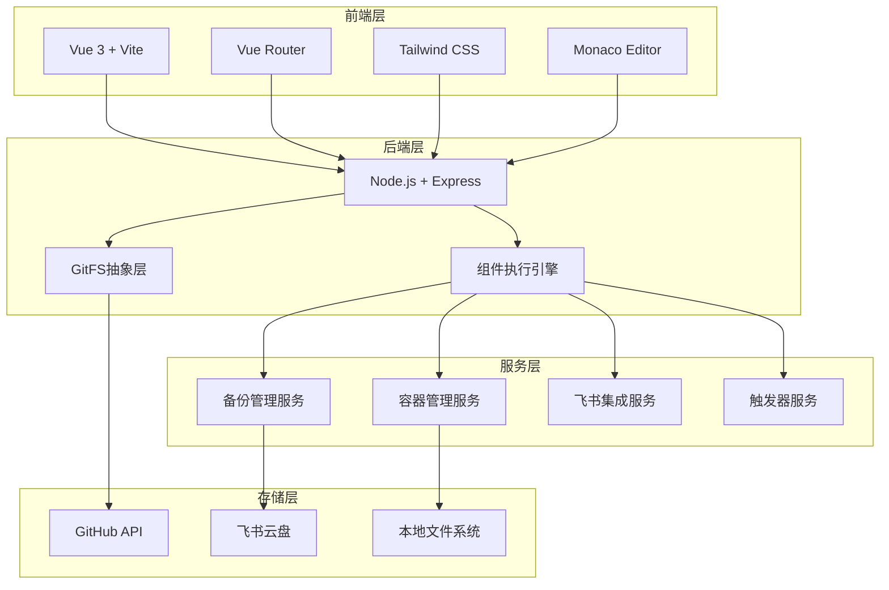

<div align="center">

# 🚀 Orchestrator Pro

### **下一代智能系统编排平台**

[](https://github.com/your-username/orchestrator-pro)
[](LICENSE)
[](https://nodejs.org/)
[](https://vuejs.org/)
[](https://docker.com/)

**🎯 架构收敛 · 核心服务精通 · 组件化驱动**

[快速开始](#-快速开始) • [功能特性](#-功能特性) • [架构设计](#-架构设计) • [文档](#-文档) • [贡献指南](#-贡献指南)

</div>

---

## ✨ 项目简介

**Orchestrator Pro** 是一个革命性的智能系统编排平台，专为现代DevOps团队设计。通过组件化架构和可视化工作流设计器，让复杂的系统部署和管理变得简单而优雅。

### 🎯 核心理念

- **🏗️ 架构收敛**：统一的技术栈，降低系统复杂度
- **🔧 核心服务精通**：内置系统服务，开箱即用
- **🧩 组件化驱动**：所有操作都通过官方组件完成
- **🎨 可视化设计**：直观的工作流设计器
- **⚡ 高性能**：基于Vue 3 + Vite的现代化前端

---

## 🌟 功能特性

### 🎨 可视化工作流设计器
- **拖拽式设计**：直观的工作流构建体验
- **实时预览**：即时查看工作流执行效果
- **版本控制**：GitFS集成的配置管理
- **模板库**：丰富的预置工作流模板

### 🐳 容器管理 (对标Docker Desktop)
- **容器生命周期**：启动、停止、删除、重启
- **镜像管理**：拉取、删除、标签管理
- **Docker Compose**：可视化编辑器 + YAML编辑器
- **实时监控**：容器状态和资源使用情况

### 🔧 系统服务管理
- **容器管理服务**：Docker/Podman集成
- **备份管理服务**：自动化备份策略
- **飞书集成服务**：企业级协作支持
- **配置中心**：统一的JSON配置管理

### ⚡ 智能触发器
- **定时触发器**：Cron表达式支持
- **Webhook触发器**：HTTP事件驱动
- **手动触发器**：按需执行工作流
- **系统事件触发器**：容器启动等系统事件

### 🧩 组件生态
- **官方组件**：开箱即用的核心组件
- **用户组件**：自定义组件开发
- **公共/私有**：灵活的组件可见性控制
- **Monaco编辑器**：专业的代码编辑体验

---

## 🏗️ 架构设计

### 技术栈



### 核心组件

| 组件 | 描述 | 技术 |
|------|------|------|
| **工作流引擎** | 执行和管理工作流 | Node.js + child_process |
| **GitFS** | GitHub文件系统抽象 | Octokit + Git API |
| **组件系统** | 可插拔组件架构 | ES Modules + 动态加载 |
| **容器管理** | Docker/Podman集成 | Docker SDK + execa |
| **配置中心** | 统一配置管理 | JSON + GitFS |

---

## 🚀 快速开始

### 环境要求

- **Node.js** 18.0+ 
- **Docker** 或 **Podman** (可选)
- **Git** (用于版本控制)

### 安装步骤

```bash
# 1. 克隆仓库
git clone https://github.com/your-username/orchestrator-pro.git
cd orchestrator-pro

# 2. 安装依赖
npm install

# 3. 环境配置
cp .env.example .env
# 编辑 .env 文件，配置GitHub和飞书信息

# 4. 构建前端资源
npm run web:build

# 5. 启动服务
npm start
```

### 🎯 首次使用

1. **访问Web界面**：打开 http://localhost:3000
2. **配置系统服务**：在"系统服务"页面配置容器管理和备份服务
3. **创建工作流**：在"工作流"页面设计您的第一个工作流
4. **添加触发器**：在"触发器"页面设置自动化触发条件

---

## 📖 使用指南

### Web界面

```bash
# 启动Web服务器
npm start

# 开发模式 (热重载)
npm run web:dev

# 构建生产版本
npm run web:build
```

### 命令行界面

```bash
# 启动CLI
npm run cli

# 查看帮助
orchestrator-pro --help
```

### 容器管理

```bash
# 列出所有容器
curl http://localhost:3000/api/containers

# 启动容器
curl -X POST http://localhost:3000/api/containers/{id}/start

# 获取容器日志
curl http://localhost:3000/api/containers/{id}/logs
```

---

## 🎨 界面预览

### 工作流设计器


### 容器管理


### 系统服务


---

## 🔧 配置说明

### 环境变量

```bash
# GitHub配置
GITHUB_TOKEN=your_github_token
GITHUB_OWNER=your_username
GITHUB_REPO=your_repo

# 飞书配置 (可选)
FEISHU_APP_ID=your_app_id
FEISHU_APP_SECRET=your_app_secret
FEISHU_REDIRECT_URI=http://localhost:3000/api/feishu/auth/callback

# 服务器配置
PORT=3000
NODE_ENV=production
```

### 配置文件

系统使用GitFS进行配置管理，主要配置文件：

- `.orchestrator-pro/config.json` - 主配置文件
- `.orchestrator-pro/container-config.json` - 容器管理配置
- `.orchestrator-pro/backup-config.json` - 备份管理配置
- `.orchestrator-pro/feishu-config.json` - 飞书集成配置

---

## 🧩 组件开发

### 创建自定义组件

```javascript
// components/my-component/index.js
#!/usr/bin/env node

async function main() {
  const inputs = process.env.inputs;
  const outputs = {};
  
  try {
    const config = inputs ? JSON.parse(inputs) : {};
    
    // 您的组件逻辑
    console.log('Hello from my component!');
    
    outputs.success = 'true';
    outputs.message = 'Component executed successfully';
  } catch (error) {
    outputs.success = 'false';
    outputs.message = error.message;
  }
  
  console.log(JSON.stringify({ outputs }));
}

main().catch(console.error);
```

```json
// components/my-component/component.json
{
  "name": "my-component",
  "description": "我的自定义组件",
  "inputs": {
    "param1": {
      "type": "string",
      "description": "参数1",
      "required": true
    }
  },
  "outputs": {
    "success": {
      "type": "string",
      "description": "执行结果"
    }
  }
}
```

---

## 🤝 贡献指南

我们欢迎所有形式的贡献！

### 贡献方式

1. **Fork** 本仓库
2. 创建特性分支 (`git checkout -b feature/amazing-feature`)
3. 提交更改 (`git commit -m 'Add amazing feature'`)
4. 推送到分支 (`git push origin feature/amazing-feature`)
5. 创建 **Pull Request**

### 开发规范

- 使用 **ESLint** 进行代码检查
- 遵循 **Vue 3 Composition API** 规范
- 编写清晰的 **JSDoc** 注释
- 添加必要的 **单元测试**

### 问题报告

如果您发现了bug或有功能建议，请：

1. 查看 [Issues](https://github.com/your-username/orchestrator-pro/issues) 确认问题未被报告
2. 创建新的Issue，包含：
   - 问题描述
   - 复现步骤
   - 环境信息
   - 截图或日志

---

## 📚 文档

### 详细文档
- 📖 [完整文档](https://t1zosp7g1k7.feishu.cn/docx/QNN6dcEefohapsxmpMTcBnusnkf?from=from_copylink)
- 🎯 [快速开始指南](#-快速开始)
- 🏗️ [架构设计文档](#-架构设计)
- 🧩 [组件开发指南](#-组件开发)

### API文档
- 🔌 [REST API](docs/api.md)
- 🐳 [容器管理API](docs/container-api.md)
- ⚡ [触发器API](docs/trigger-api.md)

---

## 🏆 路线图

### v3.1 (计划中)
- [ ] 工作流模板市场
- [ ] 高级监控面板
- [ ] 多环境支持
- [ ] 团队协作功能

### v3.2 (未来)
- [ ] AI辅助工作流生成
- [ ] 插件生态系统
- [ ] 企业级权限管理
- [ ] 云原生部署支持

---

## 📄 许可证

本项目采用 [MIT License](LICENSE) 许可证。

---

## 🙏 致谢

感谢所有为这个项目做出贡献的开发者和社区成员！

### 特别感谢
- [Vue.js](https://vuejs.org/) - 渐进式JavaScript框架
- [Vite](https://vitejs.dev/) - 下一代前端构建工具
- [Tailwind CSS](https://tailwindcss.com/) - 实用优先的CSS框架
- [Docker](https://docker.com/) - 容器化平台
- [Monaco Editor](https://microsoft.github.io/monaco-editor/) - 代码编辑器

---

<div align="center">

### ⭐ 如果这个项目对您有帮助，请给我们一个Star！

[](https://github.com/your-username/orchestrator-pro)
[](https://github.com/your-username/orchestrator-pro)

**🚀 让系统编排变得简单而优雅！**

</div>