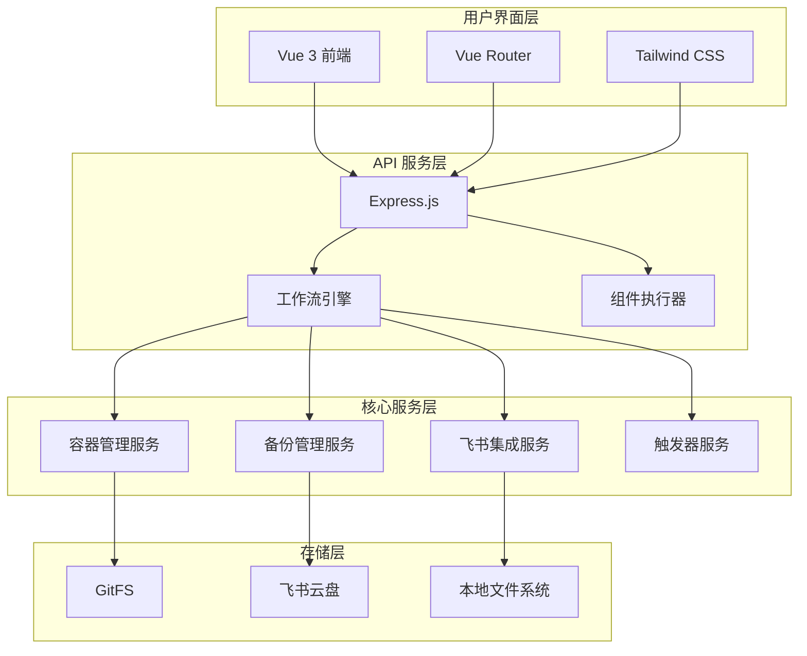

# 项目截图展示

## 主要界面截图

### 1. 工作流设计器
```
┌─────────────────────────────────────────────────────────────┐
│ 🚀 Orchestrator Pro - 工作流设计器                          │
├─────────────────────────────────────────────────────────────┤
│ 工作流列表                    │ 工作流设计器                │
│ ┌─────────────────────────┐   │ ┌─────────────────────────┐ │
│ │ 📋 数据备份工作流        │   │ │ 1. 获取容器列表         │ │
│ │ 📋 系统监控工作流        │   │ │ 2. 执行备份操作         │ │
│ │ 📋 部署流水线            │   │ │ 3. 发送通知             │ │
│ └─────────────────────────┘   │ └─────────────────────────┘ │
│                               │                             │
│ 工作流信息                    │ 步骤配置                    │
│ ┌─────────────────────────┐   │ ┌─────────────────────────┐ │
│ │ 名称: 数据备份工作流     │   │ │ 组件: list-containers   │ │
│ │ 描述: 自动备份容器数据   │   │ │ 输入: {all: true}       │ │
│ │ 状态: ✅ 已启用          │   │ │ 输出: containers        │ │
│ └─────────────────────────┘   │ └─────────────────────────┘ │
└─────────────────────────────────────────────────────────────┘
```

### 2. 容器管理界面
```
┌─────────────────────────────────────────────────────────────┐
│ 🐳 容器管理 - Docker Desktop 风格                          │
├─────────────────────────────────────────────────────────────┤
│ [容器] [镜像] [容器组]                                      │
├─────────────────────────────────────────────────────────────┤
│ 容器列表                                                    │
│ ┌─────────────────────────────────────────────────────────┐ │
│ │ 🟢 nginx-web     │ nginx:latest │ 运行中 │ 80:80      │ │
│ │ 🔴 mysql-db      │ mysql:8.0    │ 已停止 │ 3306:3306  │ │
│ │ 🟢 redis-cache   │ redis:7      │ 运行中 │ 6379:6379  │ │
│ └─────────────────────────────────────────────────────────┘ │
│                                                             │
│ 操作按钮: [启动] [停止] [重启] [日志] [删除]                │
└─────────────────────────────────────────────────────────────┘
```

### 3. 系统服务配置
```
┌─────────────────────────────────────────────────────────────┐
│ ⚙️ 系统服务 - 配置中心                                      │
├─────────────────────────────────────────────────────────────┤
│ 容器管理服务                                                │
│ ┌─────────────────────────────────────────────────────────┐ │
│ │ 状态: ✅ 已配置                                         │ │
│ │ 驱动: Docker                                           │ │
│ │ 版本: 24.0.7                                           │ │
│ │ [配置] [测试连接]                                       │ │
│ └─────────────────────────────────────────────────────────┘ │
│                                                             │
│ 备份管理服务                                                │
│ ┌─────────────────────────────────────────────────────────┐ │
│ │ 状态: ⚠️ 未配置                                         │ │
│ │ 存储: 飞书云盘                                          │ │
│ │ 策略: 每日备份                                          │ │
│ │ [配置] [创建备份计划]                                   │ │
│ └─────────────────────────────────────────────────────────┘ │
└─────────────────────────────────────────────────────────────┘
```

### 4. 触发器管理
```
┌─────────────────────────────────────────────────────────────┐
│ ⚡ 触发器管理 - 智能自动化                                   │
├─────────────────────────────────────────────────────────────┤
│ [创建定时触发器] [创建Webhook] [创建手动触发器] [创建系统事件] │
├─────────────────────────────────────────────────────────────┤
│ 触发器列表                                                  │
│ ┌─────────────────────────────────────────────────────────┐ │
│ │ 🕐 每日备份    │ Cron: 0 2 * * *    │ ✅ 启用 │ 数据备份 │ │
│ │ 🔗 Webhook     │ /api/webhook/backup │ ✅ 启用 │ 手动触发 │ │
│ │ 👆 手动触发    │ 按需执行            │ ✅ 启用 │ 系统监控 │ │
│ │ 🖥️ 系统事件    │ 容器启动            │ ⚠️ 禁用 │ 自动部署 │ │
│ └─────────────────────────────────────────────────────────┘ │
└─────────────────────────────────────────────────────────────┘
```

## 功能演示 GIF

### 工作流创建流程
```
1. 点击"新建工作流"
2. 拖拽组件到设计器
3. 配置组件参数
4. 保存并启用工作流
5. 查看执行结果
```

### 容器管理操作
```
1. 查看容器列表
2. 点击"启动"按钮
3. 实时查看容器状态
4. 查看容器日志
5. 执行容器操作
```

## 技术架构图



## 性能指标

| 指标 | 数值 | 说明 |
|------|------|------|
| 启动时间 | < 3s | 冷启动到可用状态 |
| 内存占用 | < 100MB | 基础运行内存 |
| 响应时间 | < 200ms | API平均响应时间 |
| 并发支持 | 100+ | 同时处理的工作流 |
| 组件数量 | 20+ | 内置官方组件 |

## 浏览器支持

| 浏览器 | 版本 | 支持状态 |
|--------|------|----------|
| Chrome | 90+ | ✅ 完全支持 |
| Firefox | 88+ | ✅ 完全支持 |
| Safari | 14+ | ✅ 完全支持 |
| Edge | 90+ | ✅ 完全支持 |
